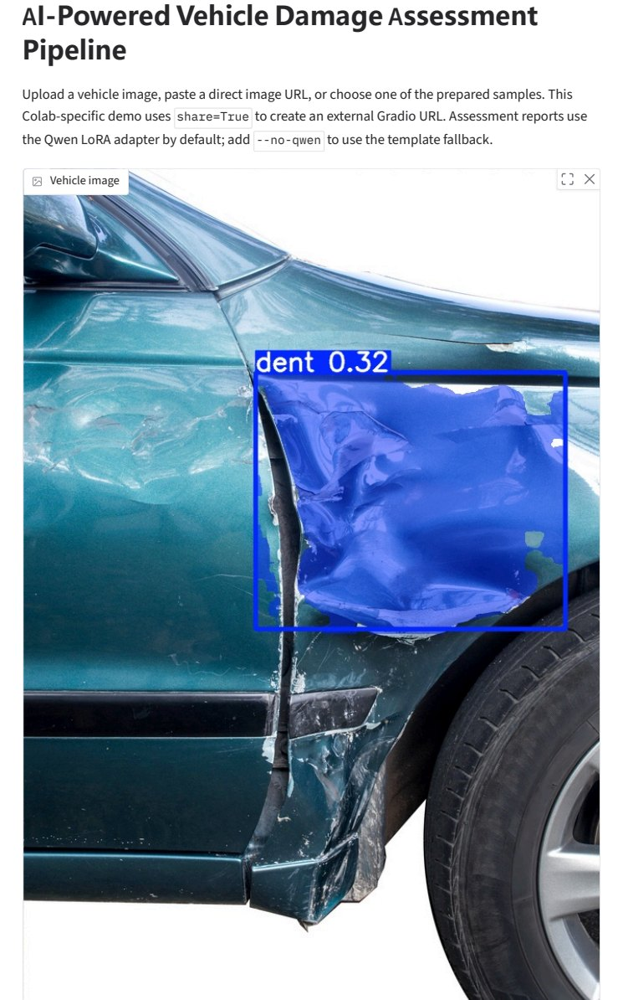
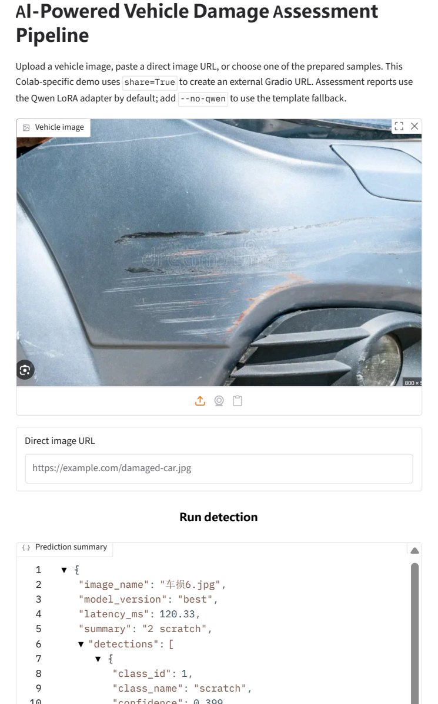
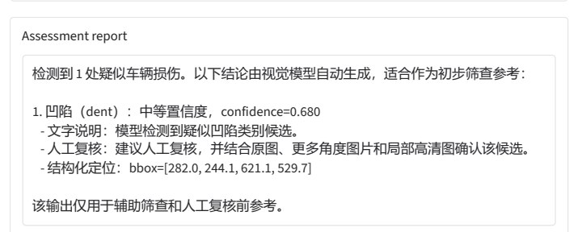

<p align="right">
  <a href="README.md"><kbd>English</kbd></a>
</p>

# AI 驱动的车辆损伤评估流水线

这是一个端到端 AI 工程项目，覆盖车辆损伤检测、实例分割、结构化推理输出、受约束报告生成，以及 RAG/LLM 评估。

项目使用 CarDD 作为视觉数据集，使用 YOLO11 segmentation 作为检测器。大型数据集、模型权重、LoRA adapter 和生成产物保存在 Google Drive；GitHub 只保留轻量工程代码、Colab runbook、配置、测试和文档。

## 项目构成

```text
车辆图像
  -> YOLO11n-seg 损伤检测与实例分割
  -> 结构化 prediction JSON
  -> Qwen LoRA 支持的中英文项目级/单图报告
  -> 用于指标一致性、检索覆盖和禁用声明检查的 RAG/LLM 评估
  -> FastAPI + Gradio 推理 demo
```

本项目不声称达到 SOTA，也不是生产级保险定损系统。它是一个面向作品集和面试展示的 AI 工程项目，重点展示可复现性、服务边界、评估闭环和诚实的能力边界。

## Demo 预览

Colab public demo 支持上传车辆图片、粘贴直接图片 URL，或选择预置样例图片。主界面展示紧凑的 prediction summary、检测表格和短报告；完整 prediction JSON 放在折叠的 debug 面板中，并在打印 demo 页面为 PDF 时隐藏。

互联网开放图片可能超出 CarDD 的类别和数据域覆盖范围。未检出代表模型没有找到支持类别中的高置信候选，不等于车辆没有损伤。

<table>
  <tr>
    <td width="50%">
      
    </td>
    <td width="50%">
      
    </td>
  </tr>
  <tr>
    <td align="center"><sub>上传图片 / 预置样例推理</sub></td>
    <td align="center"><sub>直接图片 URL 工作流</sub></td>
  </tr>
</table>

<p align="center">
  
</p>

## 当前结果

默认已完成实验：

```text
Model: YOLO11n-seg
Dataset: CarDD
Epochs: 100
Image size: 1024
Batch size: 7
GPU: Colab L4
Training time: about 4.1 hours
```

测试集指标：

```text
Box  precision: 0.6717
Box  recall:    0.6374
Box  mAP50:     0.6746
Box  mAP50-95:  0.5111

Mask precision: 0.6795
Mask recall:    0.6242
Mask mAP50:     0.6712
Mask mAP50-95:  0.4917
```

表现较强的类别是 `glass shatter`、`tire flat` 和 `lamp broken`。较难类别是 `crack`、`scratch` 和 `dent`。

## 仓库结构

```text
configs/                         数据集配置模板
docs/                            模型/数据卡、runbook、评估说明
notebooks/                       使用 !python -m 命令的轻量 Colab runbook
src/vehicle_damage_pipeline/     工程化 Python package
tests/                           轻量行为测试
requirements-colab.txt           Colab 依赖列表
pyproject.toml                   本地 package 元数据
```

## Colab 工作流

使用 Google Drive 根目录：

```text
/content/drive/MyDrive/CarDD_YOLO11
```

按顺序运行 notebooks：

```text
01_train_cardd_yolo11_seg.ipynb
02_demo_cardd_yolo11_seg.ipynb
03_finetune_qwen7b_report_lora.ipynb
04_generate_llm_report_qwen7b.ipynb
06_colab_qwen_report_eval_full_workflow.ipynb
07_colab_final_portfolio_validation.ipynb
08_colab_public_url_demo_test.ipynb
```

`06_colab_qwen_report_eval_full_workflow.ipynb` 是当前 Task 1+2 报告/eval 主流程 runbook。它会把最新轻量 GitHub 代码同步到 Drive，复用已有 Qwen LoRA adapter 并使用 `--skip-if-complete`，检查最新公开指标，生成经过验证的报告，运行 LLM/RAG eval，并备份证据包。

`07_colab_final_portfolio_validation.ipynb` 用于作品集收口验证。它会基于已有 Drive artifacts 验证 package 测试、项目报告 eval、单图报告安全性、紧凑 demo 展示 helper 和最终轻量证据备份。

`08_colab_public_url_demo_test.ipynb` 用于排练公开 Gradio demo 流程。它支持上传图片或直接在线图片 URL，并把完整 prediction JSON 放进折叠且打印隐藏的 debug 面板，避免损伤图片的 mask 导致打印/PDF 页面过长。

这些 notebooks 现在是 runbook。它们安装本 package，并调用 CLI：

```bash
!python -m vehicle_damage_pipeline.data.prepare_cardd --drive-root /content/drive/MyDrive/CarDD_YOLO11
!python -m vehicle_damage_pipeline.vision.train_yolo --drive-root /content/drive/MyDrive/CarDD_YOLO11 --model yolo11n-seg.pt
!python -m vehicle_damage_pipeline.vision.predict --weights /content/drive/MyDrive/CarDD_YOLO11/runs/train/yolo11n_seg/weights/best.pt --source /content/drive/MyDrive/CarDD_YOLO11/demo_images --output /content/drive/MyDrive/CarDD_YOLO11/runs/predict/demo
!python -m vehicle_damage_pipeline.report.build_context --drive-root /content/drive/MyDrive/CarDD_YOLO11
!python -m vehicle_damage_pipeline.llm.finetune_report_lora --drive-root /content/drive/MyDrive/CarDD_YOLO11 --skip-if-complete --train-examples 1200 --eval-examples 120 --epochs 1 --max-seq-length 1024
!python -m vehicle_damage_pipeline.report.generate --context /content/drive/MyDrive/CarDD_YOLO11/reports/qwen7b_report_context.json --language Chinese --backend qwen --adapter-dir /content/drive/MyDrive/CarDD_YOLO11/llm_adapters/qwen2_5_7b_cardd_report_lora
!python -m vehicle_damage_pipeline.eval.run_llm_eval --context /content/drive/MyDrive/CarDD_YOLO11/reports/qwen7b_report_context.json --report /content/drive/MyDrive/CarDD_YOLO11/reports/qwen7b_final_report.md --knowledge-root /content/drive/MyDrive/CarDD_YOLO11 --output-json /content/drive/MyDrive/CarDD_YOLO11/reports/llm_eval_summary.json --output-markdown /content/drive/MyDrive/CarDD_YOLO11/reports/llm_eval_summary.md
```

`report.generate` 和 Gradio/API 报告层默认使用 Qwen LoRA adapter。低显存或离线运行时，可以添加 `--no-qwen` 使用确定性的 template fallback。LoRA 训练 CLI 支持断点/重连：当 Drive 中已有完整 adapter 时，它会写入 metadata 并跳过训练，除非显式传入 `--force-retrain`。

## 可复现等级

| Level | 所需访问 | 可运行内容 |
| --- | --- | --- |
| Level 1 | 无 CarDD 数据、无权重、无 Drive artifacts | 安装 package，运行单元测试，检查代码和文档/runbook。 |
| Level 2 | 拥有 CarDD 授权数据访问 | 转换标注，训练/评估 YOLO11n-seg，导出 ONNX，重新生成指标。 |
| Level 3 | 拥有本项目私有 Drive artifacts | 无需重训即可运行 demo 推理、Qwen adapter 报告、RAG/LLM eval 和证据备份。 |

公开 GitHub 仓库默认是 Level 1。不要公开私有 `CarDD_YOLO11` Drive 根目录，因为其中包含授权数据、权重、adapter、ONNX 导出、runs 和 backups。若需要公开 artifact 文件夹，必须单独整理，只包含轻量 demo 截图/PDF、report/eval summary、文档和 notebooks。

安装选项：

```bash
pip install -e ".[dev]"
pip install -e ".[vision,service,dev]"
pip install -e ".[vision,llm,service,dev]"
```

## 推理服务

FastAPI：

```bash
set VEHICLE_DAMAGE_WEIGHTS=<Google Drive desktop mirror>\CarDD_YOLO11\runs\train\yolo11n_seg\weights\best.pt
set VEHICLE_DAMAGE_QWEN_ADAPTER_DIR=<Google Drive desktop mirror>\CarDD_YOLO11\llm_adapters\qwen2_5_7b_cardd_report_lora
uvicorn vehicle_damage_pipeline.service.api:app --host 0.0.0.0 --port 8000
```

Endpoints：

```text
GET  /health
POST /predict
POST /report
```

Gradio：

```bash
python -m vehicle_damage_pipeline.service.gradio_app --weights "<Google Drive desktop mirror>\CarDD_YOLO11\runs\train\yolo11n_seg\weights\best.pt" --adapter-dir "<Google Drive desktop mirror>\CarDD_YOLO11\llm_adapters\qwen2_5_7b_cardd_report_lora"
```

## RAG/LLM 评估

评估模块检查：

- README、docs、report JSON、run summaries 和 demo labels 的检索覆盖；
- 基于 `qwen7b_report_context.json` 的指标提及是否 grounded；
- 必需报告章节是否存在；
- 是否出现 SOTA 或生产级保险定损等禁用声明。

输出：

```text
reports/llm_eval_summary.json
reports/llm_eval_summary.md
```

## GitHub 安全边界

不要提交：

```text
CarDD_release.zip
data_raw/
data_coco/
data_yolo/
runs/
*.pt
*.onnx
llm_adapters/
private Drive links
tokens or credentials
```

这些 artifacts 保存在 Google Drive 中。

## 引用

```bibtex
@article{wang2023cardd,
  title={CarDD: A New Dataset for Vision-Based Car Damage Detection},
  author={Wang, Xinkuang and Li, Wenjing and Wu, Zhongcheng},
  journal={IEEE Transactions on Intelligent Transportation Systems},
  volume={24},
  number={7},
  pages={7202--7214},
  year={2023},
  doi={10.1109/TITS.2023.3258480}
}
```
